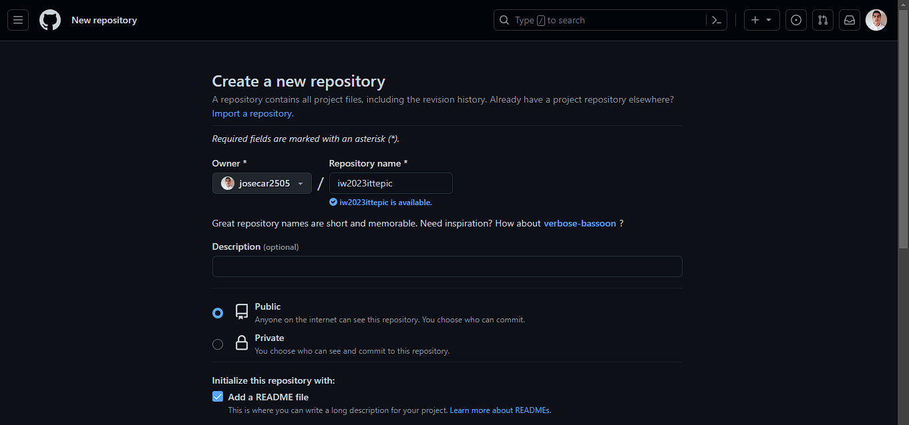
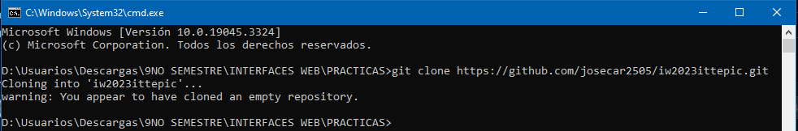
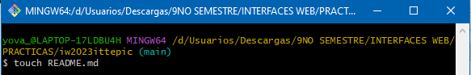
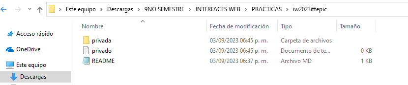
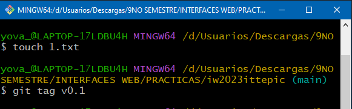

Práctica Unidad 1 - GIT
1. Crear repositorio en GitHub
    
    

2. Clonar repositorio

   git clone https://github.com/josecar2505/iw2023ittepic.git 

    

4. Crear archivo README.md

   touch README.md

    

5.	Escribir todos los comandos utilizados en la práctica y hacer commit

  	git add README.md

6.	Subir los cambios al repositorio remoto (PUSH)

  	git push 

7.	Crear archivo llamado privado.txt

  	touch privado.txt

8.	Crear carpeta llamada privada.txt

  	mkdir privada.txt

    
  	
10.	Ignorar archivos, se crea el archivo .gitignore y se modifica agregando los archivos que queremos ignorar

  	touch .gitignore

11.	Crear archivo llamado 1.txt en el repositorio local y un tag v0.1

  	Touch 1.txt
    Git tag v0.1

    

12. Creación de una tabla con información acerca de 5 compañeros de clase
    
| Nombre	| GitHub |
| ------------ | ------------ |
| CALVARIO RAMIREZ JOSÉ    | https://github.com/JoseCalvario8 |
| MEDINA SOTO CARLOS ALAN    | https://github.com/Rockoletal |
| ESTRADA GARCÍA CHRISTOPHER JAIR    |	https://github.com/EsGaCristo |
| RAMÍREZ REA ERICK DARIO    | https://github.com/Elery2711 |
| PACHECO ROSALES VICTOR MANUEL	| https://github.com/XxXelbichoXxX |
